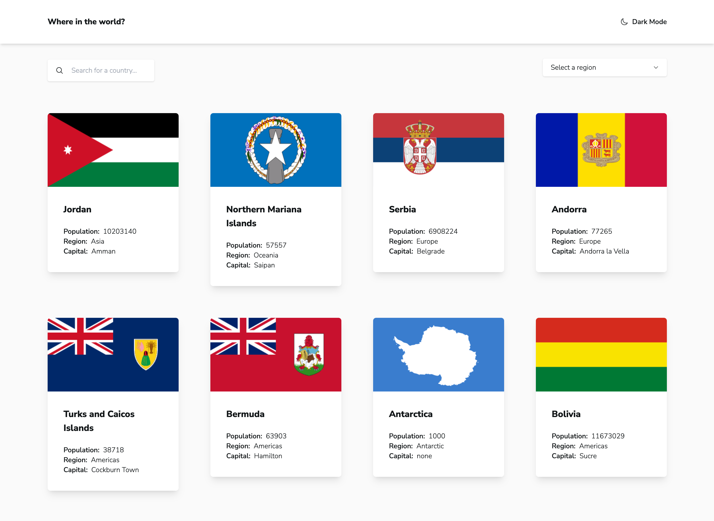

# Frontend Mentor - REST Countries API with color theme switcher solution

This is a solution to the [REST Countries API with color theme switcher challenge on Frontend Mentor](https://www.frontendmentor.io/challenges/rest-countries-api-with-color-theme-switcher-5cacc469fec04111f7b848ca). Frontend Mentor challenges help you improve your coding skills by building realistic projects. 

## Table of contents

- [Overview](#overview)
  - [The challenge](#the-challenge)
  - [Screenshot](#screenshot)
  - [Links](#links)
- [My process](#my-process)
  - [Built with](#built-with)
  - [What I learned](#what-i-learned)
  - [Notes](#notes)
  - [Useful resources](#useful-resources)
- [Author](#author)

## Overview

### The challenge

Users should be able to:

- See all countries from the API on the homepage
- Search for a country using an `input` field
- Filter countries by region
- Click on a country to see more detailed information on a separate page
- Click through to the border countries on the detail page
- Toggle the color scheme between light and dark mode *(optional)*

### Screenshot

### Links

- Solution URL: [Add solution URL here](https://your-solution-url.com)
- Live Site URL: [Add live site URL here](https://your-live-site-url.com)

## My process

### Built with

- Tailwind CSS for styling
- Flexbox
- CSS Grid
- Mobile-first workflow
- [Vue 3](https://vuejs.org/) - JS library
- [Vite](https://vuejs.org/) - Build tool

### Notes

Some of the things we can improve in this project is caching the response. in order to reduce API requests. also the error handling, in case if the request fails we should show to the users a meaningful alert.

### Useful resources

- [Vue Router](https://router.vuejs.org/) - this library used to handle client side routing.
- [VueUse](https://vueuse.org/) - This is an amazing collection composable utilities, I used it to handle dark mode toggle.

## Author

- Frontend Mentor - [@mehdilight](https://www.frontendmentor.io/profile/mehdilight)
- Twitter - [@mehdiislight](https://www.twitter.com/mehdiislight)
- LinkedIn - [mehdilight](https://www.linkedin.com/in/mehdilight)
